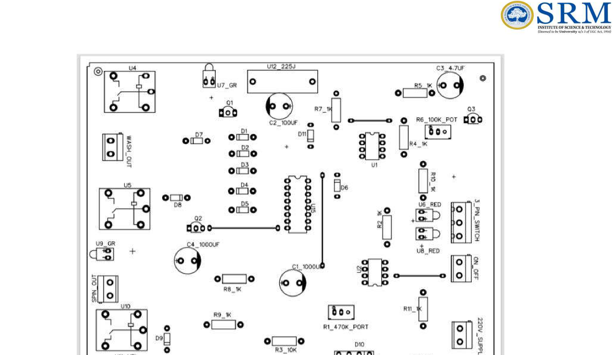
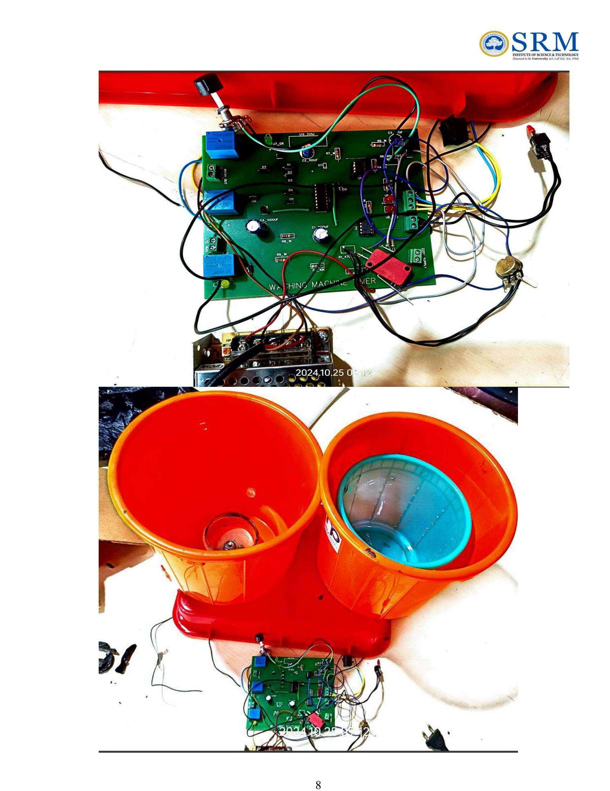

# Manual Washing Machine Timer Circuit

> **🏆 First Prize — College Hackathon | NE555 + CD4017 + Relay Control | Custom PCB (EasyEDA) | No Microcontroller**

---

## Overview

A fully hardware-based timer circuit that automates the wash and spin cycles of a manual washing machine — no microcontroller, no software. Built entirely with discrete components and ICs on a custom-designed PCB.

The circuit upgrades a basic manual washing machine into a semi-automatic system, giving users precise control over cycle duration and motor speed through adjustable potentiometers.

**Won First Prize** at a college-level hackathon for innovation in practical consumer electronics.

**Project context:** Consumer Electronics & Embedded Systems | SRM Institute of Science and Technology, Oct–Nov 2024

---

## How It Works

```
220V AC Supply
      │
      ▼
Bridge Rectifier (DC conversion)
      │
      ▼
Two NE555 Timers (Astable Mode)
  │         │
  │         └── 470kΩ pot → controls SPIN cycle duration
  └──────────── 100kΩ pot → controls WASH cycle duration
      │
      ▼
CD4017 Decade Counter
  │
  └── 10 sequential outputs → BC547 transistors → SPST Relays
            │                        │
            ▼                        ▼
       WASH MOTOR               SPIN MOTOR
  (only one active at a time — mutual exclusion by design)
```

**Manual 3-way switch** overrides the automatic timing at any point, allowing full manual control over wash/spin mode.

---

## Circuit Diagram


---

## PCB Layout



PCB designed in **EasyEDA**. Upload your EasyEDA project JSON to reproduce the board. Gerber files are included in the `pcb/` folder for direct fabrication.

---

## Hardware Photos



---

## Components

| Component | Value/Part | Quantity | Role |
|---|---|---|---|
| Timer IC | NE555 | 2 | Astable pulse generation |
| Decade Counter | CD4017 | 1 | Cycle sequencing |
| Transistors | BC547 (NPN) | 3 | Relay switching drivers |
| Relays | SPST 5V | 3 | Motor + spin control |
| Diodes | 1N4148 | 6 | Back-EMF protection |
| Capacitors | 1000µF, 100µF, 4.7µF | 4 | Power smoothing + timing |
| Potentiometers | 100kΩ, 470kΩ | 2 | Wash/spin duration adjust |
| Resistors | 1kΩ, 10kΩ | 5 | Current limiting |
| Bridge Rectifier | — | 1 | 220V AC → DC |
| LED Indicators | Red, Green, Yellow | 5 | Mode feedback |
| Switch | 3-way manual | 1 | Manual override |
| PCB | Custom (EasyEDA) | 1 | Fabricated board |
| Power Supply | 220V AC mains | — | Input supply |

---

## Key Features

**Automated cycle control** — NE555 in astable mode generates continuous clock pulses. CD4017 divides them into 10 sequential stages, each mapped to a wash or spin phase.

**Adjustable timing** — 100kΩ pot controls wash duration; 470kΩ pot controls spin duration. User sets these before starting — no reprogramming needed.

**Mutual exclusion** — Only one motor (wash OR spin) runs at a time. CD4017 output logic ensures this by design, preventing simultaneous operation.

**Back-EMF protection** — 1N4148 diodes across each relay coil absorb voltage spikes when relays switch off, protecting BC547 transistors and ICs.

**Manual override** — 3-way switch lets user bypass the timer and directly control wash/spin mode at any point in the cycle.

**LED feedback** — 5 LEDs indicate current mode (wash/spin/idle) so user can monitor status at a glance.

---

## Timing Calculation (NE555 Astable)

```
Frequency = 1.44 / ((R_A + 2*R_B) * C)

For Wash Timer (100kΩ pot):
  R_A = 1kΩ, R_B = 0–100kΩ (adjustable), C = 100µF
  Period range: ~14s to ~1,400s (adjustable wash cycle)

For Spin Timer (470kΩ pot):
  R_A = 1kΩ, R_B = 0–470kΩ (adjustable), C = 4.7µF
  Period range: ~0.7s to ~330s (adjustable spin cycle)
```

---

## PCB Files

| File | Description |
|---|---|
| `pcb/washing_machine_timer.json` | EasyEDA source file (schematic + PCB) |
| `pcb/gerber/` | Gerber files for PCB fabrication |

To open in EasyEDA: `File → Import → EasyEDA` → select the `.json` file.

---

## Results

- 555 timers generated stable, accurate timing pulses across full potentiometer range
- Relays operated cleanly with no cross-triggering between wash and spin
- Transistors provided sufficient current gain to drive relays without heat issues
- 3-way switch override worked correctly at all cycle stages
- Circuit simulated in **Proteus** before fabrication — all functional requirements verified

---

## Team

Mohammed Ayaan · Team Members
Hackathon: Consumer Electronics Innovation — SRM Institute of Science and Technology | Oct–Nov 2024

